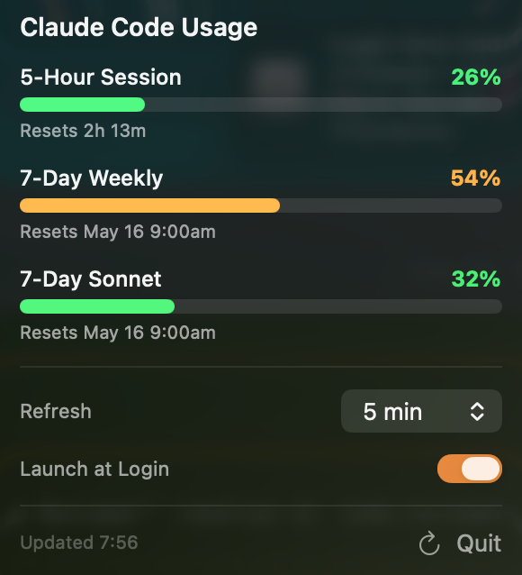

# CCMeter

A macOS menu bar app that displays your [Claude Code](https://docs.anthropic.com/en/docs/claude-code) usage at a glance.

<p align="center">
  
  &emsp;
  
</p>

## Features

- **Menu bar donut chart** -- shows 5-hour session and 7-day weekly utilization as nested rings
- **Detailed popover** -- 5-Hour Session, 7-Day Weekly, and 7-Day Sonnet rate limits with progress bars and reset times
- **Auto-refresh** -- configurable polling interval (1 / 3 / 5 / 10 / 15 / 30 / 60 min)
- **Launch at Login** -- optional auto-start on macOS boot

## Requirements

- macOS 14.0 (Sonoma) or later
- [Claude Code](https://docs.anthropic.com/en/docs/claude-code) CLI installed and signed in

## Plan compatibility

| Feature | Pro | Max |
|---|---|---|
| 7-Day Weekly usage | ✓ | ✓ |
| 7-Day Sonnet usage | ✓ | ✓ |
| 5-Hour Session usage | — | ✓ |

The 5-Hour Session row is only shown on Max plan. The Anthropic API does not return 5-hour session data for Pro plan subscribers, so that section is hidden automatically.

## Keychain Access

CCMeter reads the OAuth credentials that Claude Code stores in the macOS Keychain (service: `Claude Code-credentials`). On first launch, macOS will prompt you to allow Keychain access -- this is required for the app to authenticate with the Anthropic API and fetch your usage data.

The app never performs its own OAuth login flow and never modifies Keychain entries. It only reads the token that Claude Code has already saved.

**Periodic re-authorization:** macOS may show the Keychain access prompt again approximately once a day. This happens because Claude Code periodically refreshes its OAuth token, which recreates the Keychain item and resets the access permission for other apps. This is expected macOS security behavior, not a bug.

**Privacy:** All data is processed locally on your Mac. Your credentials and usage statistics are never sent to any server other than Anthropic's official API endpoints.

## Installation

### Build from source

Xcode (or the Xcode Command Line Tools with Swift 5.9+) is required.

```sh
git clone https://github.com/s-age/ccmeter.git
cd ccmeter
./Scripts/build.sh --install
```

This builds a release binary, assembles `CCMeter.app`, code-signs it, and copies it to `/Applications`.

#### Build options

| Flag | Description |
|------|-------------|
| `--clean` | Clean build artifacts before building |
| `--test` | Run tests before building |
| `--install` | Install to `/Applications` after building |
| `--skip-icon` | Skip app icon generation |
| `--no-sign` | Skip code signing |

## License

MIT
